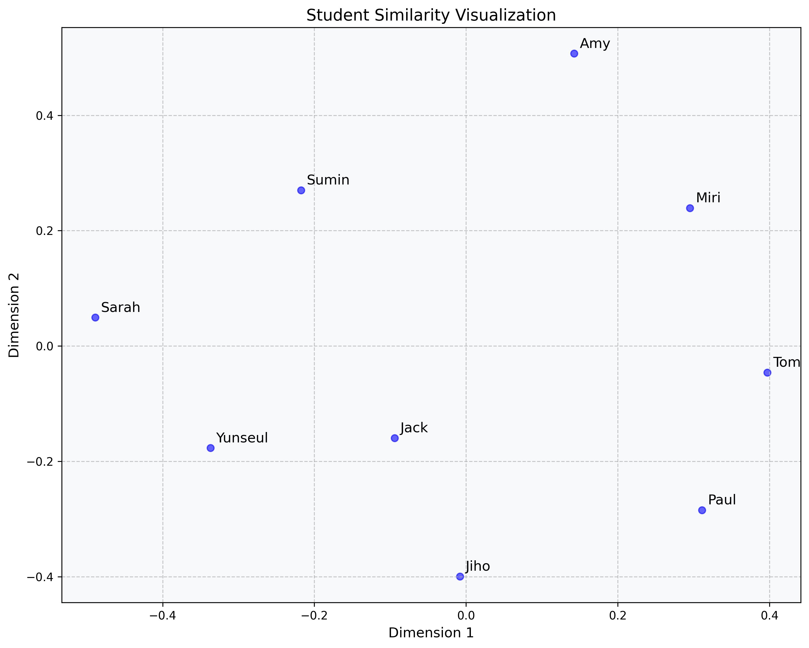
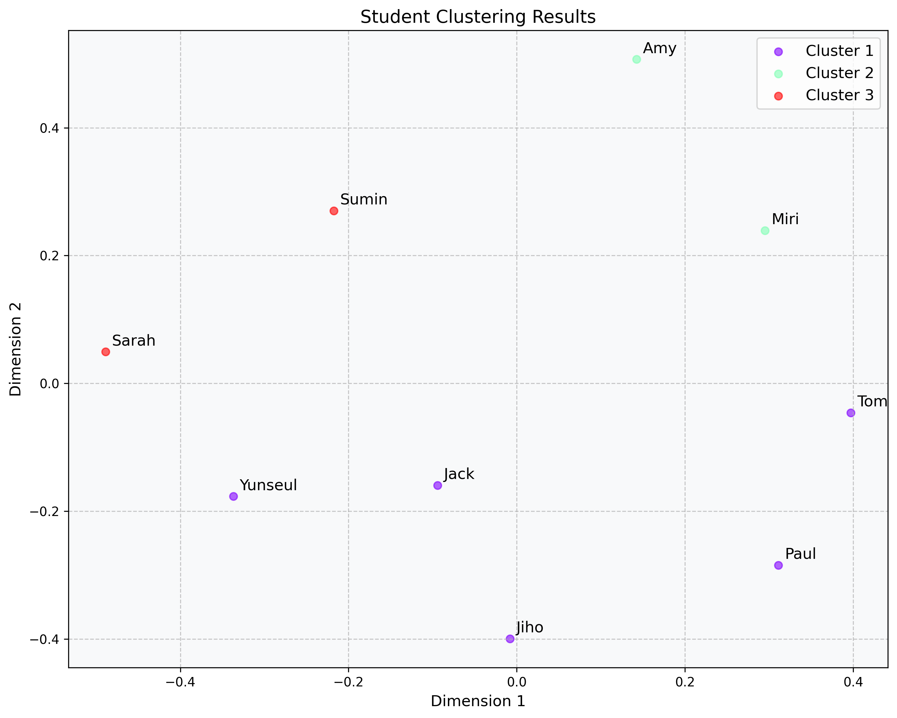

# Study Group Matching Service

A service for matching study groups using cosine similarity, agglomerative clustering, and Multi-Dimensional Scaling (MDS).

## Visualization Examples

### Similarity Matrix  


### Clustering Results  


## Features

- Student profile management (JSON-based)
- Automatic group matching based on feature vectors
- Cosine similarity calculation between students
- Agglomerative clustering for group formation
- 2D visualization using MDS
- Intuitive visualization of similarity and clustering results

## Used Libraries

- numpy
- scikit-learn (cosine_similarity, AgglomerativeClustering, MDS)
- json
- matplotlib

## Quick Start

1. **Install dependencies**
   ```bash
   pip install numpy scikit-learn matplotlib
   ```

2. **Prepare student data**
   - Edit or add your student profiles in `students_data.json`.

3. **Run group matching and visualization**
   ```bash
   python generate_visualizations.py
   ```

4. **Check results**
   - Visualizations are saved in `docs/images/`.

## Project Structure

- `vector.py` : Student data vectorization and JSON handling
- `algorithm.py` : Similarity calculation, clustering, and MDS
- `show_matrix.py` : Similarity matrix visualization
- `show_clustering.py` : Clustering result visualization
- `generate_visualizations.py` : End-to-end group matching and visualization

## Configuration

The system can be configured through `config.py`:
- Logging levels
- Visualization settings
- Analysis parameters

## Contributing

1. Fork the repository
2. Create your feature branch
3. Commit your changes
4. Push to the branch
5. Create a Pull Request
   
# Used library

- numpy 
- sklearn (cosine_similarity, AgglomerativeClustering, MDS)
- json
- matplotlib

# Code

[algorithm.py](https://github.com/941-life/study-group/blob/main/algorithm.py) : Main code, here we calculate the cosine similarity, agglomerative clustering, Multi Dimensional Scaling(MDS).

[show_clustering.py](https://github.com/941-life/study-group/blob/main/show_clustering.py) : Visualize clustered data with matplotlib using Algorithm.py's function

[show_matrix.py](https://github.com/941-life/study-group/blob/main/show_matrix.py) : Visualize matrix that transforms a cosine similarity based matrix into a distance matrix

[students_data.json](https://github.com/941-life/study-group/blob/main/students_data.json) : Json file of student's information including vectorized data

[vector.py](https://github.com/941-life/study-group/blob/main/vector.py) : Preprocessing and vectorize the data from user. Values can be directly entered at the main function and save the data as a json file.

